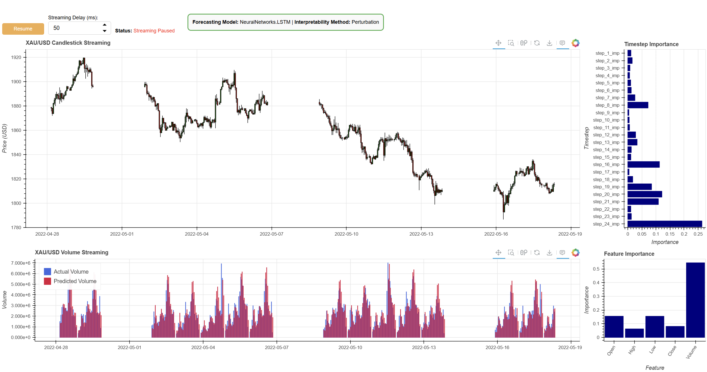
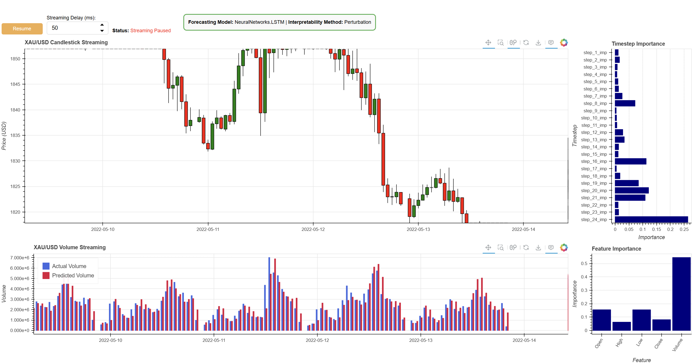
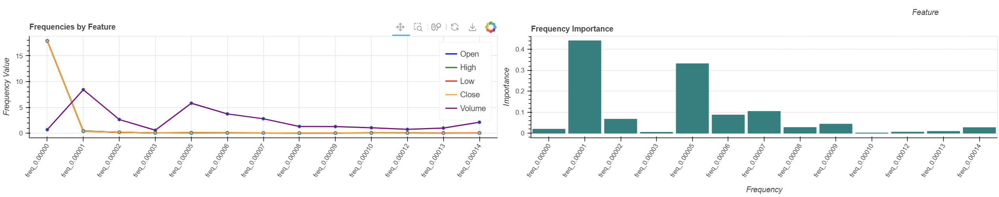
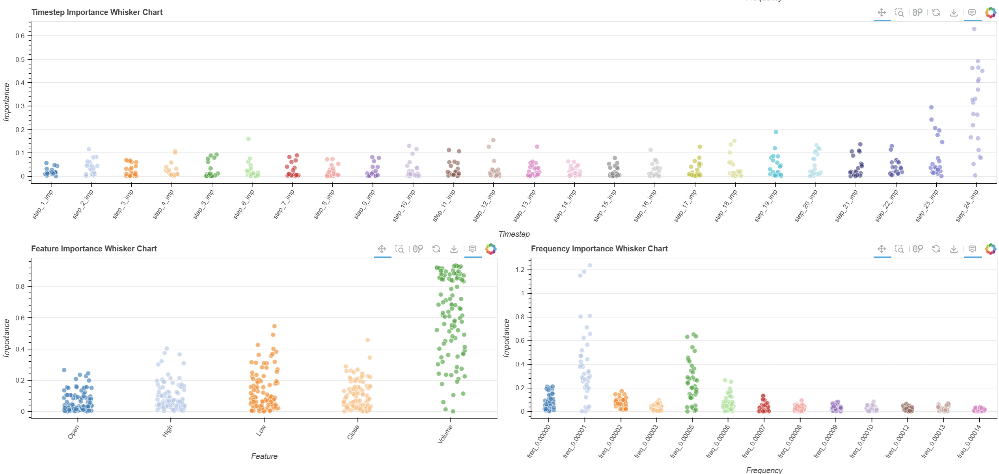
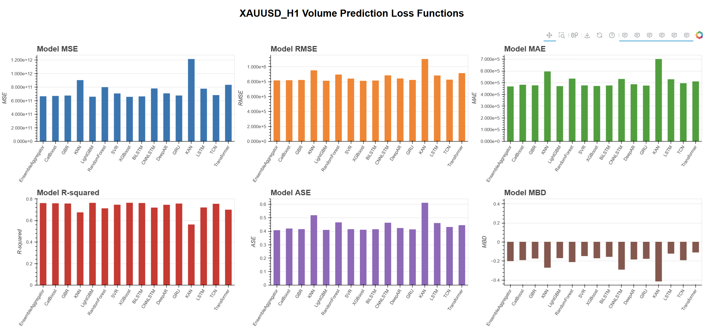

# Interpretability of Neural Networks in Financial Volume Prediction

## Introduction

Welcome to the **Interpretability of Neural Networks in Financial Volume Prediction** project! This work focuses on predicting trading volume in financial markets using various Neural Networks and Machine Learning models implemented in Python 3.9.20. The core contribution of this project is its emphasis on the interpretability of machine learning models, allowing us to gain deeper insights into the decision-making processes of these systems.

The project implements multiple interpretability techniques, such as Occlusion Perturbation Method, SHAP, and LIME, enabling users to understand model predictions comprehensively. Results are visualized using the Bokeh library, providing interactive and dynamic plots for better insights into model performance, predictions, and interpretability.

## Requirements

To successfully run this project, ensure you have the following installed:

- **Anaconda Distribution**: For package and environment management.
  - Download: [Anaconda Individual Edition](https://www.anaconda.com/products/individual)
- **Conda Version 23.1.0**: Used for creating and managing the virtual environment.
- **Python 3.9.20**: The project is built and tested on this version.
- **Bokeh Library**: For interactive visualization of the results.
- **Additional Dependencies**: All required Python packages are listed in the `environment.yml` file.

## How to Use

### 1. Setting Up the Environment

First, clone the repository and navigate to the project directory. Then, create and activate the conda virtual environment using the provided `environment.yml` file.

```bash
# Clone the repository
git clone https://github.com/aliamiryan99/Financial-NN-Prediction-Interpretability

cd Financial-NN-Prediction-Interpretability

# Create the conda environment
conda env create -f environment.yml

# Activate the environment
conda activate FPI
```

### 2. Configuring the Model

The configuration for the models is located in `Configs/config.yml`. You can specify various parameters for model training, data processing, and interpretability.

**Example of `config.yml`**

```yaml
# Config.yaml
model: NeuralNetworks.LSTM # ex. NeuralNetworks.LSTM, NeuralNetworks.BiLSTM, etc.
data: ForexData/XAUUSD_H1
interpretability_class: "Perturbation" # ex. Perturbation, SHAP, LIME
interpretation_type: "Time" # ex. Time, Spectral
preprocess_parameters:
  filter_holidays: True
model_parameters:
  feature_columns: ["Open", "High", "Low", "Close", "Volume"]
  target_column: Volume
  seq_length: 24 # Length of input sequence
  train_ratio: 0.8 # 80% of data used for training
  validation_split: 0.1 # Use 10% of the training data for validation
  epochs: 10 # Number of epochs for training
  batch_size: 32 # Batch size for training
  optimizer: "adam" # Optimizer method for training
  loss: "mean_squared_error" # Loss function for training
  verbose: True # Show detail processing of training the NN model
stream_visualization:
  batch_size: 1 # Streaming one data point at a time
  update_interval: 50 # Initial streaming interval in ms
  max_points: 500 # Maximum number of points to display
  time_frame: "H" # Time frame to specify the width of candles
  show_aggregator: False # To change the stream approach for plotting the ensemble method with range
dashboard_visualization:
  n_cols: 3 # Number of column grid of loss charts
```

### 3. Training and Testing the Model

To train and test the selected model, run the following command:

```bash
python Scripts/train_test.py
```

This script will:

- Read the configuration from `Configs/config.yml`.
- Load and preprocess the data from the specified path (e.g., `ForexData/XAUUSD_H1`).
- Train the model specified (e.g., `NeuralNetworks.LSTM`).
- Save the trained model and results in the `Results/Forecasting/{data}` directory.

### 4. Running Interpretability Analysis

To analyze and interpret the model’s predictions, use the `interpret.py` script. This script implements various methods like Occlusion Perturbation, SHAP, and LIME. Specify the desired method in the `config.yml` file and run:

```bash
python Scripts/interpret.py
```

This script will:

- Load the trained model from experiments according to config model specification.
- Apply the specified interpretability method.
- Provide results, including feature or frequency importance, depending on the `interpretation_type` (Time or Spectral).
- Save the results in the `Results/Interpretability/{data}` directory.

### 5. White Noise Analysis

A novel script, `white_noise.py`, has been added to evaluate the model’s response to white noise inputs containing all frequencies. While initial experiments have not yielded significant findings, this approach is a step towards innovative model evaluation.

To run this script:

```bash
python Scripts/white_noise.py
```

### 6. Streaming the Results

To stream the results in real-time using Bokeh, specify the name of the result file in the `Views/streamer.py` file. Then, run the following command:

```bash
bokeh serve --show Scripts/stream.py
```

### 7. Visualizing the Loss Results

To visualize all the loss results stored in the `Results/{data}` folder on a Bokeh dashboard, run:

```bash
bokeh serve --show Scripts/dashboard.py
```

## Result Samples

After running the training and testing scripts, and visualizing the results, you can expect:

<!-- - **Training and Validation Loss Plots**: Visual representations of the model's performance over each epoch. -->

- **Predicted vs. Actual Volume**: Interactive plots showing how well the model's predictions align with the actual trading volumes along side the Candlestick chart.
- **Real-time Streaming Visualization**: Live updates of model predictions if streaming data is used.
- **Interpretability factors**: Demonstrating the interpretation of each prediction in the stream mode. Including the feature importance, timestep importance and frequency importance. Also the wisker chart for each one so we can track the importance history of each.
- **Evaluation Metrics**: Aggregated views of different model performances for comparison.

<!-- **Example Loss Plot:**


_Note: Replace `Results/sample_loss_plot.png` with the actual path to your sample image._ -->

**Example Prediction and Interpretation Plots:**

<div align="center">

Unzoomed Candlestick and Volume charts along side the interpretability charts <br/> 

</div>

<div align="center">

Zoomed ones <br/> 

</div>

<div align="center">

Frequency charts including Magnitude for each feature and the frequency importance <br/> 

</div>

<div align="center">

Whisker charts for better understanding of importance histories <br/> 

</div>

<div align="center">

Evaluation Charts <br/> 

</div>

<div align="center">
   The total streaming frames 
</div>

<br />
<br />

---

Feel free to explore and modify the project to suit your needs. If you encounter any issues or have suggestions for improvement, please open an issue or submit a pull request.

Happy forecasting!
