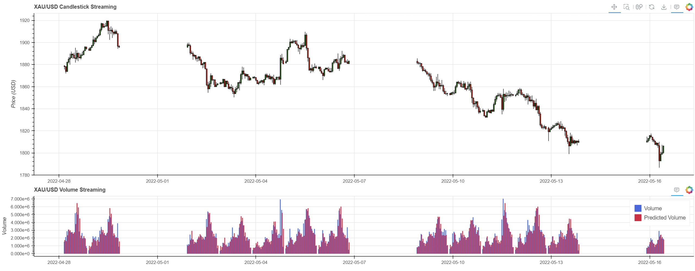
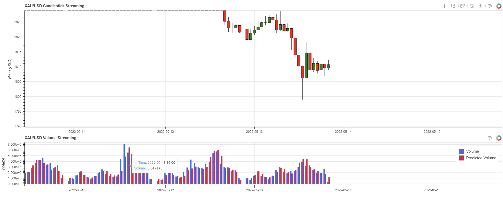
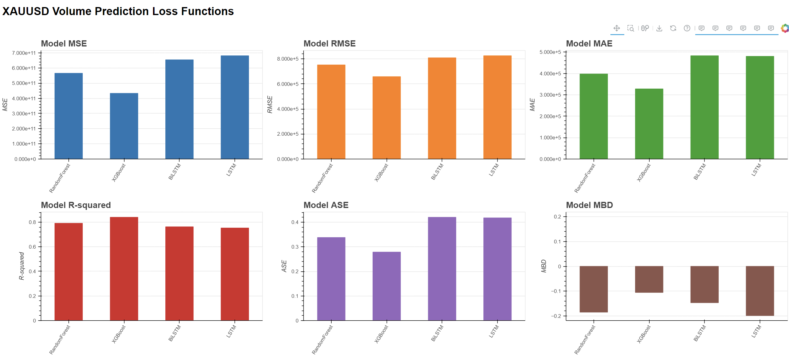

# Financial Volume Prediction Project

## Introduction

Welcome to the **Financial Volume Prediction Project**! This project focuses on predicting trading volume in financial markets using various Neural Networks and Machine Learning models implemented in Python 3.9.20. The primary goal is to analyze and forecast the volume of financial instruments, which is crucial for traders and financial analysts.

The results are visualized using the Bokeh library, providing interactive and dynamic plots for better insight into model performance and predictions.

## Requirements

To successfully run this project, ensure you have the following installed:

- **Anaconda Distribution**: For package and environment management.
  - Download: [Anaconda Individual Edition](https://www.anaconda.com/products/individual)
- **Conda Version 23.1.0**: Used for creating and managing the virtual environment.
- **Python 3.9.20**: The project is built and tested on this version.
- **Bokeh Library**: For interactive visualization of the results.
- **Additional Dependencies**: All required Python packages are listed in the `environment.yml` file.

## How to Use

### 1. Setting Up the Environment

First, clone the repository and navigate to the project directory. Then, create and activate the conda virtual environment using the provided `environment.yml` file.

```bash
# Clone the repository
git clone https://github.com/your-username/your-repo-name.git
cd your-repo-name

# Create the conda environment
conda env create -f environment.yml

# Activate the environment
conda activate FPI
```

### 2. Configuring the Model

The configuration for the models is located in `Configs/config.yml`. You can specify various parameters for model training and data processing.

**Example of `config.yml`:**

```yaml
# Config.yaml
model: NeuralNetworks.BiLSTM # Options: NeuralNetworks.LSTM, NeuralNetworks.BiLSTM, etc.
data: ForexData/XAUUSD_H1
model_parameters:
  feature_columns: ["Open", "High", "Low", "Close", "Volume"]
  target_column: Volume
  seq_length: 24 # Length of input sequence
  train_ratio: 0.8 # 80% of data used for training
  epochs: 10 # Number of epochs for training
  batch_size: 32 # Batch size for training
```

Feel free to modify the configuration according to your requirements.

### 3. Training and Testing the Model

To train and test the selected model, run the following command:

```bash
python Scripts/train_test_model.py
```

This script will:

- Read the configuration from `Configs/config.yml`.
- Load and preprocess the data from the specified path (e.g., `ForexData/XAUUSD_H1`).
- Train the model specified (e.g., `NeuralNetworks.BiLSTM`).
- Save the trained model and results in the `Results/{data}` directory.

### 4. Streaming the Results

To stream the results in real-time using Bokeh, specify the name of the result file in the `Views/streamer.py` file. Then, run the following command:

```bash
bokeh serve --show Scripts/stream.py
```

This will:

- Launch a Bokeh server.
- Open a new browser window displaying the streaming plot of the model's predictions.

### 5. Visualizing the Loss Results

To visualize all the loss results stored in the `Results/{data}` folder on a Bokeh dashboard, run:

```bash
bokeh serve --show Scripts/dashboard.py
```

This command will start a Bokeh server and display an interactive dashboard in your web browser, where you can explore and analyze the loss metrics of your models.

## Result Samples

After running the training and testing scripts, and visualizing the results, you can expect:

<!-- - **Training and Validation Loss Plots**: Visual representations of the model's performance over each epoch. -->

- **Predicted vs. Actual Volume**: Interactive plots showing how well the model's predictions align with the actual trading volumes.
- **Real-time Streaming Visualization**: Live updates of model predictions if streaming data is used.
- **Dashboard Metrics**: Aggregated views of different model performances for comparison.

<!-- **Example Loss Plot:**


_Note: Replace `Results/sample_loss_plot.png` with the actual path to your sample image._ -->

**Example Prediction Plots:**

<div align="center">

Unzoomed streamer sample plot <br/> 

</div>

<div align="center">

Zoomed streamer sample plot <br/> 

</div>

<div align="center">
Dashboard sample plot<br/>
  
  
</div>

---

Feel free to explore and modify the project to suit your needs. If you encounter any issues or have suggestions for improvement, please open an issue or submit a pull request.

Happy forecasting!
